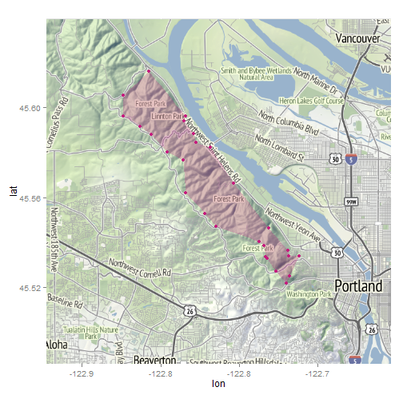

Forest Park Trail Runs
======================
Map trail running routes through [Forest Park](http://www.portlandoregon.gov/parks/finder/index.cfm?&propertyid=127&action=ViewPark).

Last updated 2014-03-15 08:53:39 using R version 3.0.2 (2013-09-25).


Load packages.


```r
packages <- c("RCurl", "plotKML", "geosphere", "ggmap", "ggplot2", "RColorBrewer", 
    "data.table", "sp", "xtable")
sapply(packages, require, character.only = TRUE, quietly = TRUE)
```

```
## plotKML version 0.4-2 (2013-01-15) URL:
## http://plotkml.r-forge.r-project.org/
```

```
##        RCurl      plotKML    geosphere        ggmap      ggplot2 
##         TRUE         TRUE         TRUE         TRUE         TRUE 
## RColorBrewer   data.table           sp       xtable 
##         TRUE         TRUE         TRUE         TRUE
```


Read coordinates for Forest Park waypoints.


```r
url <- getURL("https://docs.google.com/spreadsheet/pub?key=0ApyhYsT8Gi-EdFBUYk4wb0UyYlUweHg1SHlfX3VHV1E&single=true&gid=1&output=csv", 
    cainfo = system.file("CurlSSL", "cacert.pem", package = "RCurl"))
dfWaypoints <- read.csv(textConnection(url), header = TRUE)
print(xtable(rbind(head(dfWaypoints), tail(dfWaypoints)), digits = 7), type = "html")
```

<!-- html table generated in R 3.0.2 by xtable 1.7-1 package -->
<!-- Sat Mar 15 08:53:49 2014 -->
<TABLE border=1>
<TR> <TH>  </TH> <TH> trail </TH> <TH> waypoint </TH> <TH> lat </TH> <TH> lon </TH> <TH> isEdge </TH>  </TR>
  <TR> <TD align="right"> 1 </TD> <TD> Wildwood Trail </TD> <TD> Burnside Rd </TD> <TD align="right"> 45.5215696 </TD> <TD align="right"> -122.7195009 </TD> <TD> TRUE </TD> </TR>
  <TR> <TD align="right"> 2 </TD> <TD> Wildwood Trail </TD> <TD> Pittock Mansion </TD> <TD align="right"> 45.5248043 </TD> <TD align="right"> -122.7177391 </TD> <TD> TRUE </TD> </TR>
  <TR> <TD align="right"> 3 </TD> <TD> Wildwood Trail </TD> <TD> Cornell Rd </TD> <TD align="right"> 45.5268969 </TD> <TD align="right"> -122.7264093 </TD> <TD> TRUE </TD> </TR>
  <TR> <TD align="right"> 4 </TD> <TD> Wildwood Trail </TD> <TD> Danford Balch Homesite </TD> <TD align="right"> 45.5284844 </TD> <TD align="right"> -122.7246820 </TD> <TD> FALSE </TD> </TR>
  <TR> <TD align="right"> 5 </TD> <TD> Wildwood Trail </TD> <TD> Holman Ln </TD> <TD align="right"> 45.5331160 </TD> <TD align="right"> -122.7202034 </TD> <TD> FALSE </TD> </TR>
  <TR> <TD align="right"> 6 </TD> <TD> Wildwood Trail </TD> <TD> Aspen Trail </TD> <TD align="right"> 45.5374433 </TD> <TD align="right"> -122.7221380 </TD> <TD> FALSE </TD> </TR>
  <TR> <TD align="right"> 61 </TD> <TD> Firelane 8 </TD> <TD> NW Germantown Rd </TD> <TD align="right"> 45.5871410 </TD> <TD align="right"> -122.7961911 </TD> <TD> FALSE </TD> </TR>
  <TR> <TD align="right"> 62 </TD> <TD> Firelane 9 </TD> <TD> NW MacKay Ave </TD> <TD align="right"> 45.5939867 </TD> <TD align="right"> -122.7849507 </TD> <TD> TRUE </TD> </TR>
  <TR> <TD align="right"> 63 </TD> <TD> Firelane 10 </TD> <TD> Newton Rd </TD> <TD align="right"> 45.5915020 </TD> <TD align="right"> -122.8023951 </TD> <TD> FALSE </TD> </TR>
  <TR> <TD align="right"> 64 </TD> <TD> Firelane 10 </TD> <TD> NW Germantown Rd </TD> <TD align="right"> 45.5898750 </TD> <TD align="right"> -122.7909750 </TD> <TD> FALSE </TD> </TR>
  <TR> <TD align="right"> 65 </TD> <TD> Firelane 12 </TD> <TD> NW Creston Rd </TD> <TD align="right"> 45.6162383 </TD> <TD align="right"> -122.8074015 </TD> <TD> TRUE </TD> </TR>
  <TR> <TD align="right"> 66 </TD> <TD> Firelane 15 </TD> <TD> NW Skyline Blvd </TD> <TD align="right"> 45.5961899 </TD> <TD align="right"> -122.8235789 </TD> <TD> TRUE </TD> </TR>
   </TABLE>


Let's use only the waypoints that define the edges of Forest Park.


```r
dfEdges <- dfWaypoints[dfWaypoints$isEdge, ]
```


Show the waypoints that are edges, or boundaries, of Forest Park.


```r
dfEdges <- dfWaypoints[dfWaypoints$isEdge, ]
order <- seq(1, nrow(dfEdges))
cbind(order, dfEdges)
```

```
##    order               trail            waypoint   lat    lon isEdge
## 1      1      Wildwood Trail         Burnside Rd 45.52 -122.7   TRUE
## 2      2      Wildwood Trail     Pittock Mansion 45.52 -122.7   TRUE
## 3      3      Wildwood Trail          Cornell Rd 45.53 -122.7   TRUE
## 10     4      Wildwood Trail          NW 53rd Dr 45.54 -122.7   TRUE
## 28     5      Wildwood Trail      NW Newberry Rd 45.61 -122.8   TRUE
## 31     6     Leif Erikson Dr       Dogwood Trail 45.55 -122.7   TRUE
## 42     7 Lower Macleay Trail        NW Upshur St 45.53 -122.7   TRUE
## 43     8           Holman Ln          NW 53rd Dr 45.53 -122.7   TRUE
## 44     9           Holman Ln       NW Raleigh St 45.53 -122.7   TRUE
## 45    10        Aspen Trail         NW Aspen Ave 45.54 -122.7   TRUE
## 46    11        Birch Trail           NW 53rd Dr 45.53 -122.7   TRUE
## 47    12       Dogwood Trail          NW 53rd Dr 45.54 -122.7   TRUE
## 48    13         Saltzman Rd     NW Skyline Blvd 45.56 -122.8   TRUE
## 49    14         Saltzman Rd 6099 NW Saltzman Rd 45.57 -122.8   TRUE
## 50    15        Ridge Trail   8545 NW Bridge Ave 45.58 -122.8   TRUE
## 51    16      Springville Rd 8645 NW Whitney Ave 45.58 -122.8   TRUE
## 52    17        Waterline Rd    NW Willalatin Rd 45.58 -122.8   TRUE
## 53    18      Tolinda Trail     NW Germantown Rd 45.59 -122.8   TRUE
## 54    19       Linnton Trail     NW St Helens Rd 45.60 -122.8   TRUE
## 55    20           Newton Rd     NW Skyline Blvd 45.59 -122.8   TRUE
## 56    21           BPA Road      NW Skyline Blvd 45.59 -122.8   TRUE
## 58    22          Firelane 2     NW Skyline Blvd 45.55 -122.8   TRUE
## 59    23          Firelane 3 NW Thunder Crest Dr 45.55 -122.8   TRUE
## 60    24          Firelane 7   NW Springville Rd 45.58 -122.8   TRUE
## 62    25          Firelane 9       NW MacKay Ave 45.59 -122.8   TRUE
## 65    26         Firelane 12       NW Creston Rd 45.62 -122.8   TRUE
## 66    27         Firelane 15     NW Skyline Blvd 45.60 -122.8   TRUE
```


Reorder the 27 waypoints so they can be used to generate a polygon. Start at the north end at Firelane 12 and NW Creston Rd (a.k.a. "12 o'clock") and go clockwise.


```r
order <- c(13, 12, 14, 17, 27, 8, 11, 15, 10, 9, 15, 16, 20, 7, 6, 5, 22, 4, 
    2, 23, 24, 18, 19, 21, 3, 1, 26)
dfEdges <- dfEdges[order(order), ]
cbind(order = seq(1:max(order)), dfEdges)
```

```
##    order               trail            waypoint   lat    lon isEdge
## 65     1         Firelane 12       NW Creston Rd 45.62 -122.8   TRUE
## 54     2       Linnton Trail     NW St Helens Rd 45.60 -122.8   TRUE
## 62     3          Firelane 9       NW MacKay Ave 45.59 -122.8   TRUE
## 53     4      Tolinda Trail     NW Germantown Rd 45.59 -122.8   TRUE
## 51     5      Springville Rd 8645 NW Whitney Ave 45.58 -122.8   TRUE
## 50     6        Ridge Trail   8545 NW Bridge Ave 45.58 -122.8   TRUE
## 49     7         Saltzman Rd 6099 NW Saltzman Rd 45.57 -122.8   TRUE
## 31     8     Leif Erikson Dr       Dogwood Trail 45.55 -122.7   TRUE
## 45     9        Aspen Trail         NW Aspen Ave 45.54 -122.7   TRUE
## 44    10           Holman Ln       NW Raleigh St 45.53 -122.7   TRUE
## 42    11 Lower Macleay Trail        NW Upshur St 45.53 -122.7   TRUE
## 2     12      Wildwood Trail     Pittock Mansion 45.52 -122.7   TRUE
## 1     13      Wildwood Trail         Burnside Rd 45.52 -122.7   TRUE
## 3     14      Wildwood Trail          Cornell Rd 45.53 -122.7   TRUE
## 43    15           Holman Ln          NW 53rd Dr 45.53 -122.7   TRUE
## 46    16        Birch Trail           NW 53rd Dr 45.53 -122.7   TRUE
## 47    17       Dogwood Trail          NW 53rd Dr 45.54 -122.7   TRUE
## 10    18      Wildwood Trail          NW 53rd Dr 45.54 -122.7   TRUE
## 58    19          Firelane 2     NW Skyline Blvd 45.55 -122.8   TRUE
## 59    20          Firelane 3 NW Thunder Crest Dr 45.55 -122.8   TRUE
## 48    21         Saltzman Rd     NW Skyline Blvd 45.56 -122.8   TRUE
## 60    22          Firelane 7   NW Springville Rd 45.58 -122.8   TRUE
## 52    23        Waterline Rd    NW Willalatin Rd 45.58 -122.8   TRUE
## 55    24           Newton Rd     NW Skyline Blvd 45.59 -122.8   TRUE
## 56    25           BPA Road      NW Skyline Blvd 45.59 -122.8   TRUE
## 66    26         Firelane 15     NW Skyline Blvd 45.60 -122.8   TRUE
## 28    27      Wildwood Trail      NW Newberry Rd 45.61 -122.8   TRUE
```


Find the geographic mean of the waypoints. Use the geographic mean as a center point for grabbing the map.


```r
geomeanFP <- geomean(dfEdges[, c("lon", "lat")])
geomeanFP
```

```
##           x     y
## [1,] -122.8 45.56
```

```r
mapFP <- get_map(location = geomeanFP, maptype = "terrain", source = "stamen", 
    zoom = 12)
```

```
## Map from URL :
## http://maps.googleapis.com/maps/api/staticmap?center=45.56285,-122.762969&zoom=12&size=%20640x640&maptype=terrain&sensor=false
## Google Maps API Terms of Service : http://developers.google.com/maps/terms
```

```r
ggmap(mapFP)
```

 


Plot the waypoints to use to identify if a run occurred inside Forest Park. Boundary waypoints are shown in a different color.


```r
g <- ggmap(mapFP, base_layer = ggplot(dfWaypoints, aes(x = lon, y = lat, color = isEdge)))
g <- g + geom_point(size = 2)
g <- g + theme(legend.position = "none")
g
```

 


Define a polygon using the boundary waypoints.


```r
polyFP <- makePoly(dfEdges[, c("lon", "lat")])
polyFP <- data.frame(polyFP)
```

```
## Warning: some row.names duplicated:
## 3,4,5,6,7,8,9,10,11,12,13,14,15,16,17,18,19,20,21,22,23,24,25,26,27,28 -->
## row.names NOT used
```


Plot the polygon.


```r
color <- brewer.pal(9, "PiYG")[1]
g <- ggmap(mapFP, base_layer = ggplot(polyFP, aes(x = lon, y = lat)))
g <- g + geom_point(color = color, size = 2)
g <- g + geom_polygon(alpha = 1/4, fill = color)
g
```

 


Use my running history as a starting point. *Will eventually want to get other runners' data.*

Get files names of GPX data files.


```r
path <- file.path("Data", "user001")
files <- dir(path = path, pattern = "\\.gpx")
```


Determine which ones are runs versus rides. Only use the runs for now.


```r
isRun <- grepl("run", tolower(files))
isRide <- grepl("ride", tolower(files))
table(isRun, isRide)
```

```
##       isRide
## isRun  FALSE
##   TRUE   516
```

```r
files <- files[isRun]
```


Use all dates since I've eliminated the processing speed bottleneck.


```r
dates <- as.Date(substr(files, 1, 8), format = "%Y%m%d")
dateFrom <- min(dates)
dateTo <- max(dates)
message(sprintf("Reading %.0d routes run from %s to %s", length(files), dateFrom, 
    dateTo))
```

```
## Reading 516 routes run from 2011-08-24 to 2014-03-10
```


Consolidate routes in one data frame.


```r
index <- c()
date <- c()
lat <- c()
lon <- c()
for (i in 1:length(files)) {
    f <- file.path(path, files[i])
    route <- readGPX(f)
    location <- route$tracks[[1]][[1]]
    index <- c(index, rep(i, dim(location)[1]))
    date <- c(date, rep(as.Date(substr(files[i], 1, 8), format = "%Y%m%d"), 
        dim(location)[1]))
    lat <- c(lat, location$lat)
    lon <- c(lon, location$lon)
}
routes <- data.frame(cbind(index, date, lat, lon))
```


Use the `point.in.polygon` function in the `sp` package to determine if a route has a point inside the Forest Park polygon.


```r
system.time(isFP <- point.in.polygon(routes$lon, routes$lat, polyFP$lon, polyFP$lat))
```

```
##    user  system elapsed 
##    0.11    0.00    0.25
```

```r
isFP <- as.logical(isFP)
includedRoutes <- unique(routes[isFP, "index"])
```


Subset the routes to include only those with points inside Forest Park.


```r
routesInRange <- subset(routes, index %in% includedRoutes)
# message(sprintf('Plotting %.0d routes within %.0d m of any waypoint
# (%.1f%% of the %.0d routes)', length(includedRoutes), rangeDist,
# length(includedRoutes) / length(files) * 100, length(files)))
message(sprintf("Plotting %.0d routes inside Forest Park (%.1f%% of the %.0d routes)", 
    length(includedRoutes), length(includedRoutes)/length(files) * 100, length(files)))
```

```
## Plotting 89 routes inside Forest Park (17.2% of the 516 routes)
```


Set titles for map.


```r
fmtDate <- "%d-%b-%Y"
title <- sprintf("Forest Park trail runs\n%.0d routes from %s to %s", length(includedRoutes), 
    format(dateFrom, fmtDate), format(dateTo, fmtDate))
```


Set map attributes. Pick an alpha that will distinguish frequently used trails. Pick a color that will contrast nicely with the green of the terrain map.


```r
alpha <- 1/4
color <- brewer.pal(9, "PiYG")[1]
size <- 1/4
theme <- theme(axis.text = element_blank(), axis.title = element_blank(), axis.ticks = element_blank())
```


Plot low resolution and high resolution versions of the routes. Only show the low resolution version. The high resolution version is saved for later.

**Need to figure out how to add the polygon layer**


```r
g <- ggmap(mapFP, base_layer = ggplot(routesInRange, aes(x = lon, y = lat, group = index)))
g <- g + geom_path(alpha = alpha, color = color, size = size)
g <- g + labs(title = title) + theme
g
```

 


```r
g <- ggmap(mapFP, base_layer = ggplot(routesInRange, aes(x = lon, y = lat, group = index)))
g <- g + geom_path(alpha = alpha, color = color, size = size)
g <- g + labs(title = title) + theme
g
```

